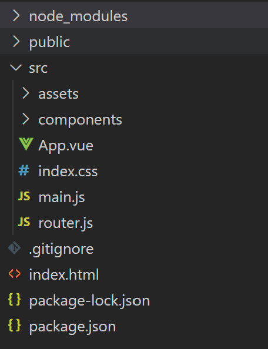

<div STYLE="page-break-after: always;">
    
    <br/>
    <br/>
    <font size=10 face="黑体">
    	<center>数据库系统原理大作业</center>
        <center>Web前端入门指南</center>
	</font>
</div>


<div>
     <font size=6 face="黑体">
     	<center>软件开发环境国家重点实验室</center>
         <center>海量数据分析与信息安全组</center>
         <br/>
    </font>
</div>

<div>
    <font size=5 face="黑体">
		&emsp;&emsp;&emsp;&emsp;&emsp;&emsp;&emsp;&emsp;&emsp;&emsp;&emsp;&emsp;&emsp;&emsp;编写：张一郎、严宇皓、余一鸣、贾惠婷、陈奕恺<br/>
    	&emsp;&emsp;&emsp;&emsp;&emsp;&emsp;&emsp;&emsp;&emsp;&emsp;&emsp;&emsp;&emsp;&emsp;审核：郎波
	</font>
</div>


## 一. 前端开发概述

### 1.1 需要掌握哪些知识？

**什么是前端？**一般来说，前端即网站前台部分，可以运行在浏览器上**展现给用户浏览的网页**。

前端涉及的技术非常多，短时间无法全部涉及。我们从数据库大作业的角度出发，希望大家花费尽可能少的时间和精力做出自己想要的网页，因此整理出如下的教程和资料。

大家使用的技术随意选择，但如果你没接触过前端开发，我们建议大家掌握如下的前端技术：


前端可使用的前端框架非常多，但无论使用哪一种，**最好都要先学习html, css, js**。只有熟悉了它们，才能方便高效地使用框架。

注：仅使用html、css和js就已经能够完成前端开发的任务。但相比于使用框架，这种方法往往是最困难、最复杂的。前端框架的作用就是替开发者完成重复而繁琐的工作，简化开发流程。磨刀不误砍柴工，所以**建议大家使用框架，不要使用原生的html、css和js来写前端**。

三大主流的前端框架作为参考：Vue、React、Angular。对于大多数人来说各个框架的上手难度并没有很大区别。本教程会以Vue为例来让大家快速上手前端。课程并不限制大家使用何种框架，但建议大家尽早确定使用的技术栈并开始学习。

### 1.2 如何做网页

在拿到模板后，我脑袋中会想：

1. 第一步从哪入手？

2. 怎么建立我网页的导航栏？

3. 在哪写页面的组件？

4. 如何更轻松地写页面的组件？

5. 写完组件后，怎么和后端联调？

6. 联调后如何部署在服务器上？

如果你是一个新手，不要急，我来慢慢告诉你如何一步步地做出自己想要的网页：

第一步，拿到模板后，想好自己网页的导航栏要写什么（导航栏就像文档的目录，起着总领的作用），在哪写导航栏？请看**"六. Vue路由"**。

第二步，导航确定好后就是如何把导航中的每个页面具体完善，在模板里的src/pages目录里建立自己的文件（可参考模板的例子，如模板里的form、list文件），注意自己定义的文件要和路由文件中一致，否则页面不会显示。建立好文件后，接下来面临的问题就是在哪写页面的组件？vue文件由\<template>\</template>、\<script>\</script>、\<style>\</style>三部分组成，页面上的大大小小组件几乎都在\<template>\</template>里写，如何轻松地写？可借助**组件文档链接**https://1x.antdv.com/docs/vue/introduce-cn/。

[ Vue Antd Admin](https://iczer.gitee.io/vue-antd-admin-docs/)是很常用的项目模板，基于该模板可以快速地构建Vue前端程序。地址：https://iczer.gitee.io/vue-antd-admin-docs/develop/page.html模板使用文档新建立一个新的页面文件，包含新建页面文件，配置路由、样式文件等操作，关于页面里需要新增哪些组件来实现需求，请看**三.组件的使用**

第三步，上述两步做完后基本上页面看上去已经成型，但只是静态的，是不能增删改查存到数据库的，那么就需要和后端联调使前端和后端的数据能够互通，这就需要在\<script>\</script>里用axios来通过请求的方式和后端联调，请看**"四. axios"**(如果你对计算机网络完全不了解，请先看**"八.网络"**)。


### 1.3 接口文档

**课程建议大家采用前后端分离的开发方式**(不知道的可自行查阅)，这样负责前端和后端的同学在开发时可以互不干扰，有利于进度的推进。

但前后端最终还是需要连接的，为了让双方通信时的数据可以统一，可以**尽早确定接口文档**。接口文档规定了前后端传输数据时所采用的格式。以json的传输形式为例，以下给出一个例子：

```json
接口作用：新增用户
接口名：add_user
请求形式：post
前端发送数据：
{
    id:int,            //用户id
 	name:string         //用户名
}
前端期望返回数据：
{
    state:int,        //状态
    error:string         //错误信息
}
```

接口文档可以由前端或后端根据需要共同商议给出，采取自己喜欢的方式即可。知道了数据传输形式以后，就可以保证在没有另一方的情况下也可以较为准确地完成开发。

### 1.4 基础语法学习建议

再强调一次，**本教程篇幅并不长，目的是给同学们一个指导作用，引导大家快速了解、入门前端，从而在学习与开发过程中少走一些弯路**。本教程并不提供系统的前端知识。如果大家在学习和开发的过程中遇到问题，欢迎在讨论区发言。

前端的学习一般需要从`HTML`、`CSS`和`JS`开始。这三者是前端开发的基石，几乎任何前端框架都离不开它们。

#### HTML

HTML(Hyper Text Markup Language)，即**超文本标记语言**。作为一种标记语言，HTML使用**标签**来对网页进行描述。对于网页来说，HTML几乎是最重要的部分，因此这里对其做进一步的介绍。

##### HTML标签

HTML标签是尖括号包围的关键词，一般来说会成对出现。例如`<h1>`标签表示一级标题，如果要以一级标题的形式显示"Hello World!"，则HTML记为：

```
<h1>Hello World!</h1>
```

这样浏览器即会以一级标题的形式渲染相关内容。

在这个例子中，`<h1>`和`</h1>`即是一组成对的标签，其中`<h1>`称为**开始标签**，`</h1>`称为**闭合标签**(或结束标签)。也有部分标签可以不成对出现，例如换行标签`<br>`。一组完整的标签及其所包裹的内容称为HTML元素。

除某些特殊情况外，HTML标签之间一般可以相互嵌套，因此一个标准的HTML页面通常有以下形式：

```
<html>
  <head>...</head>
  <body>...</body>
</html>
```

##### 元素属性

在HTML中，每个元素都有其对应的**属性**。属性可以为元素添加一些额外信息，且一般添加于开始标签中。例如下面的例子：

```
<p class="article">Hello World!</p>
```

这个例子中`p`元素的`class`属性被设定为了`article`。

有一些属性是几乎所有的元素共有的，而另外一些属性则是某元素独有。

##### 学习建议

在你知道HTML的构成方式后，你应该去学习常用的HTML标签并记住它们的作用。你可以去[这里](https://www.runoob.com/html/html-tutorial.html)进一步学习HTML。

#### CSS

CSS(Cascading Style Sheets)，即**层叠样式表**。其用于描述HTML文档的样式，即各HTML元素应该如何显示。

##### 学习建议

CSS包括的内容繁多，建议先对其做一个系统的了解，从而在调整样式时不至于一头雾水。学习时应该注意各种样式的作用以及**它们的优先级**。你可以去[这里](https://www.w3school.com.cn/css/index.asp)进一步学习CSS。

#### JavaScript

JS(JavaScript)，是一种解释性脚本语言。不同于HTML和CSS，JS是一种编程语言，其用于描述网页的行为逻辑。

##### 学习建议

对于拥有扎实编程基础的同学们来说，JS的学习并不是特别困难。学习时请留意**JS独有的一些特性**，否则，若总是按照类似C、Java等语言的思路编程，往往会出现一些奇怪的bug。你可以去[这里](https://www.w3school.com.cn/js/index.asp)进一步学习JS。

#### 总结

* HTML规定了网页的内容
* CSS告诉浏览器网页应该如何被渲染
* JS规定了网页的行为逻辑

大家学习时可以留意三者之间的关系。

### 1.5 JS与ECMAScript(ES)

某天，小明在看完JS教程后逛github时，碰到了这样的JS代码：

```
let age=(now, birth) => now - birth;
var b=['Alice','Bob']
gap(...b)
```

小明瞬间懵了：这都是什么啊？JS还能这样写吗？我怎么没看到过教程里面有这些啊？
相信初学JS的不少同学可能都有这种疑惑，那么这是怎么回事呢？

#### ECMAScript

ECMAScript(ES)是由Ecma International定义的一种脚本语言规范。JavaScript可以看作该标准的实现与扩展。ES发布了许多版本，但综合浏览器支持和普及度考虑，目前使用较多的是2015年发布的ES6版本。

目前的许多JS教程并不会介绍ES6的新特性，因此就出现了本教程一开始提到的小明这种情况。你可以在[这里](https://www.runoob.com/w3cnote/es6-concise-tutorial.html)快速浏览ES6的特性，或是在[这里](http://caibaojian.com/es6/)较为详细地浏览ES6的特性，又或者是在[这里](https://www.ecma-international.org/wp-content/uploads/ECMA-262_6th_edition_june_2015.pdf)阅读官方文档。

**同时在这里提醒大家，课程设计所使用的技术一定要支持主流浏览器(如Chrome、Firefox等)。**


## 二. Vue框架介绍

### 2.1 什么是Vue

Vue是一个写前端项目的开源JavaScript框架，可以让用户快速编写出适用各个场景的前端程序。

中文官网为: https://cn.vuejs.org/

### 2.2 Vue的特点

vue两大特点：响应式编程、组件化。

**响应式编程：**开发者不再直接操作dom对象，vue完成了操作dom的工作并自动对页面中某些数据的变化做出响应。

**组件化：**Vue一个单页应用中的各个模块拆分成一个个单独的**组件（component）**，从而提高多人协作的开发效率、方便组件代码重复使用。

### 2.3 Vue项目结构

初始化一个Vue项目，结构如下图所示：



1. node_modules: 项目使用的依赖包。
2. public: 用于存放项目使用到的一些静态资源（图片）等，在最后[webpack打包](https://so.csdn.net/so/search?q=webpack打包&spm=1001.2101.3001.7020)时会直接放入dist文件夹内。
3. src: 存放程序的源代码文件夹。
4. assets：**src里的组件**所使用的静态资源。
5. components: 放置**非路由组件和全局组件**。
6. App.vue: 项目中唯一的根组件。
7. main.js: 程序的入口文件，为项目中第一个执行的文件。
8. package-lock.json:  记录安装时的包的版本号，并且需要上传到git，以保证其他人在npm install时大家的依赖能保证一致。
9. package.json：记录vue项目的相关信息。

### 2.4 项目模板的使用

推荐大家在实际开发中使用一些现成的模板，能够大大减少工作量。以一个模板为例，代码和项目如下：

模板：[GitHub - iczer/vue-antd-admin: 🐜 Ant Design Pro's implementation with Vue](https://github.com/iczer/vue-antd-admin)

模板使用文档：https://iczer.gitee.io/vue-antd-admin-docs/start/use.html

## 三. 组件的使用


组件 (Component) 是 Vue.js 最强大的功能之一。组件可以扩展 HTML 元素，封装可重用的代码。在较高层面上，组件是自定义元素，Vue.js 的编译器为它添加特殊功能。在有些情况下，组件也可以表现为用` is `特性进行了扩展的原生 HTML 元素。

所有的` Vue 组件`同时也都是 `Vue 的实例`，所以可接受相同的选项对象 (除了一些根级特有的选项) 并提供相同的生命周期钩子。

### 3.1 组件属性

#### Props

props 是子组件用来接受父组件传递过来的数据的一个自定义属性。

- props 中的数据只能以一种方式流动——从顶部或父组件到底部或子组件。
- props 是只读的，不能由子组件修改。

#### 静态Props

静态即传入的值不变化，直接在父组件中定义，子组件中使用，使用较少。

**动态 Prop**

类似于用 v-bind 绑定 HTML 特性到一个表达式，也可以用 v-bind 动态绑定 props 的值到父组件的数据中。每当父组件的数据变化时，该变化也会传导给子组件

```html
<div id="app">
    <ol>
    <todo-item v-for="item in sites" v-bind:todo="item"></todo-item>
      </ol>
</div>
 
<script>
Vue.component('todo-item', {
  props: ['todo'],
  template: '<li>{{ todo.text }}</li>'
})
new Vue({
  el: '#app',
  data: {
    sites: [
      { text: 'a' },
      { text: 'b' },
      { text: 'c' }
    ]
  }
})
</script>
```

**Prop 验证**

组件可以为 props 指定验证要求。

为了定制 prop 的验证方式，你可以为 props 中的值提供一个带有验证需求的对象，而不是一个字符串数组。

#### $attrs

$attr：包含了父作用域中不作为 prop 被识别 (且获取) 的 attribute 绑定 (class 和 style 除外)。当一个组件没有声明任何 prop 时，这里会包含所有父作用域的绑定 (class 和 style 除外)，并且可以通过 v-bind="$attrs" 传入内部组件——在创建高级别的组件时非常有用。

### 3.2 组件注册

#### 全局注册

全局组件什么概念呢? 也就是说任何一个Vue实例对象都可以使用. ，全局组件, 一次注册, 多处调用。

一般分为三步：

1. 定义了一个组件
2. 注册组件, **在new Vue({})外面注册的, 是全局组件.** 
3. 调用组件

#### 局部注册

```javascript
const app1Comp = Vue.extend({
        template: `
            <div>
                <p>只有app1才能使用的局部注册组件</p>
            </div>
        `
    })

    let app = new Vue({
        el: "#app",
        data: {
            message: "局部注册组件"
        },
        components:{
            app1Comp: app1Comp
        }
    });
```

我们定义了一个appComp的组件, 但是注册的时候, 只注册到了app这个Vue对象里, 那么就只有app能使用,其他vue对象不能使用, 这样的组件就是局部组件.

局部组件, 哪里注册, 哪里调用（使用较为广泛）

#### 组件切换

**使用v-if和v-else结合flag进行切换**

```html
<div id="app">
    <login v-if="flag"></login>
    <register v-else="flag"></register>
</div>
```

**<component>标签实现组件切换**

```html
    <div id="app">
        <component :is="comName"></component>
    </div>
    <script>
        // 组件名称是 字符串
        Vue.component('com1', {
            template: '<h3>组件1</h3>'
        })
        Vue.component('com2', {
            template: '<h3>组件2</h3>'
        })
        // 创建 Vue 实例，得到 ViewModel
        var vm = new Vue({
            el: '#app',
            data: {
                comName: 'com1' // 当前 component 中的 :is 绑定的组件的名称
            },
            methods: {}
        });
    </script>
```

### 3.3 组件通信

#### 父子组件通信

**父组件可以通过`props`属性向子组件传值**

**父组件给子组件传值的步骤**：

（1）在子组件的`props`属性中声明父组件传递过来的数据

（2）定义子组件的模板时，使用props中的属性

（3）父组件在引用子组件时，进行属性绑定。

父组件向子组件传值示例：

```html
    <div id="app">
        <!-- 第三步：父组件在引用子组件的时候， 通过 属性绑定（v-bind:）的形式,  -->
        <!--   把 需要传递给 子组件的数据，以属性绑定的形式，传递到子组件内部，供子组件使用 -->
        <component1 v-bind:parent-msg="msg"></component1>
    </div>
    <!-- 定义子组件的模板 -->
    <template id="myTemplate">
        <!-- 第二步：在子组件的模板中，使用props中的属性 -->
        <h2 @click="change">我是子组件。我想使用父组件中的数据parentMsg： {{ parentMsg }}</h2>
    </template>
    <script>
        // 创建 Vue 实例，得到 ViewModel
        var vm = new Vue({
            el: '#app',
            data: {
                msg: '父组件中的数据123'
            },
            methods: {},
            components: {
                // 子组件默认无法访问到 父组件中的 data 中的数据 和 methods 中的方法
                component1: { //将子组件的名称定义为 component1
                    template: '#myTemplate',
                    data() { // 注意： 子组件中的 data 数据，并不是通过 父组件传递过来的，而是子组件自身私有的，比如： 子组件通过 Ajax ，请求回来的数据，都可以放到 data 身上；
                        // data 上的数据，都是可读可写的
                        return {
                            title: '子组件私有的数据 title',
                            content: '子组件私有的数据 content'
                        }
                    },
                    // 注意： 组件中的 所有 props 中的数据，都是通过 父组件 传递给子组件的
                    // props 中的数据，都是只读的，无法重新赋值
                    props: ['parentMsg'], // 第一步：把父组件传递过来的 parentMsg 属性，先在 props 数组中，定义一下，这样，才能使用这个数据
                    directives: {},
                    filters: {},
                    components: {},
                    methods: {
                        change() {
                            // 下面这行会报错，因为子组件不要直接修改父组件中的data数据
                            // this.parentMsg = '被修改了'
                        }
                    }
                }
            }
        });
    </script>
</body>
</html>
```


**子组件向父组件传值**

我们只需要在子组件通过`emit`触发父组件的方法时，把子组件的参数带出去就可以了

子组件向父组件传值示例

```html
<!DOCTYPE html>
    <div id="app">
        <component1 @parent-show='show'></component1>
    </div>

    <!-- 定义子组件的模板 -->
    <template id="myTemplate">
        <h2 @click="childClick">我是子组件，点击调用父组件的方法</h2>
    </template>

    <script>
        // 创建 Vue 实例，得到 ViewModel
        var vm = new Vue({
            el: '#app',
            data: { //父组件的data
                parentData: null
            },
            methods: { // 定义父组件的方法
                show: function (arg) { //【第二步】父组件里放参数，这个参数就代表着子组件中的 child.data
                    console.log('父组件提供的方法');
                    this.parentData = arg; //将参数arg传递给父组件的data，也就达到了目的：子组件传递数据，赋值给父组件
                    console.log('打印父组件的数据（这是子组件传过来的）：'+ JSON.stringify(this.parentData));
                }
            },
            components: {
                component1: { //将子组件的名称定义为 component1
                    template: '#myTemplate',
                    data() { // 子组件的data
                        return {
                            childData: { //定义自组件的数据
                                name: 'smyhvae',
                                age: 26
                            }
                        }
                    },
                    props: [''],
                    directives: {},
                    filters: {},
                    components: {},
                    methods: {
                        childClick() {
                            // 子组件如果要给父组件传递参数，在触发 emit 的时候，通过参数的形式带出去就可以了
                            // 【第一步】在子组件里，通过传参的形式，把子组件的data，传给父组件
                            this.$emit('parent-show', this.childData);
                        }
                    }
                }
            }
        });
    </script>
</body>
</html>
```


#### 在Vue中，通过 ref 属性获取DOM元素

我们当然可以使用JS原生的做法（document.getElementById）或者 jQuery 来获取DOM，但是这种做法却在无形中操作了DOM，在Vue框架中并不推荐这种做法。

我们可以通过`ref`属性获取DOM元素。

`ref`的英文单词是**reference**，表示**引用**。我们平时可以经常看到控制台会报错**referenceError**的错误，就和引用类型的数据有关。

**在Vue中，通过 ref 属性获取DOM元素**的步骤：

（1）第一步：在标签中给 DOM 元素设置 ref 属性。

```html
    <h3 id="app3" ref="demo"> </h3>
```

（2）第二步：通过 this.this.$refs.xxx 获取 DOM 元素

```javascript
console.log(this.$refs.demo.innerText)
```

### 3.4 模板示例

在vue-antd-admin项目中，例如 src/pages/dashboard/analysis/Analysis.vue 这个文件中的import部分就是引用的component中的组件用于展示分析页的各种图表信息。下面拿chart-card举例

```vue
<template>
  <div class="analysis">
    <a-row style="margin-top: 0" :gutter="[24, 24]">
      <a-col :sm="24" :md="12" :xl="6">
         <!-- 组件使用!-->
        <chart-card :loading="loading" :title="$t('totalSales')" total="￥ 189,345">
          <a-tooltip :title="$t('introduce')" slot="action">
            <a-icon type="info-circle-o" />
          </a-tooltip>
          <div>
            <trend style="margin-right: 16px" :term="$t('wow')" :percent="12" :is-increase="true" :scale="0" />
            <trend :term="$t('dod')" :target="100" :value="89" :scale="0" />
          </div>
          <div slot="footer">{{$ta('daily|sales', 'p')}}<span> ￥234.56</span></div>
        </chart-card>
      </a-col>
    </a-row>
    </div>
</template>
<script>
// 组件引用
import ChartCard from '../../../components/card/ChartCard' 
import MiniArea from '../../../components/chart/MiniArea'
import MiniBar from '../../../components/chart/MiniBar'
import MiniProgress from '../../../components/chart/MiniProgress'
import Bar from '../../../components/chart/Bar'
import RankingList from '../../../components/chart/RankingList'
import HotSearch from './HotSearch'
import SalesData from './SalesData'
import Trend from '../../../components/chart/Trend'
const rankList = []
for (let i = 0; i < 8; i++) {
  rankList.push({
    name: '桃源村' + i + '号店',
    total: 1234.56 - i * 100
  })
}
export default {
  name: 'Analysis',
  i18n: require('./i18n'),
  data () {
    return {
      rankList,
      loading: true
    }
  },
  created() {
    setTimeout(() => this.loading = !this.loading, 1000)
  },
  components: {Trend, SalesData, HotSearch, RankingList, Bar, MiniProgress, MiniBar, MiniArea, ChartCard} // 组件注册
}
</script>
```


## 四. axios

Axios 是一个基于 promise 的 HTTP 库，简单的讲就是可以发送get、post等请求，可以用在浏览器和 node.js 中。

http://axios-js.com/zh-cn/index.html

### 4.1 axios安装

```bash
    # yarn | npm安装
    yarn add axios | npm install axios
```

### 4.2 axios使用

```js
import axios from "axios";
axios.post("url",{}).then((res) => {
  // 接口调用成功回调
}).catch((error) => {
  // 接口调用失败毁掉
});
/*
    支持所有http请求以及请求取消、并发请求等功能，更多细节以及使用方法移步官方文档
    文档: [axios文档](http://www.axios-js.com/zh-cn/docs/)
*/
```

### 4.3 axios请求方法

主要有get，post，put，patch，delete

- get

  获取数据

- post

  提交数据（表单提交+文件上传）

- put

  更新数据（将所有数据均推放到服务端）

- patch

  更新数据（只将修改的数据推送到后端）

- delete

  删除数据

### 4.4 get方法

##### 写法

调用型

```js
 axios.get('http://localhost:8080/data').then((res)=>{
      console.log(res) // res为后端返回的数据
    })
```

axios()型

```js
axios({
  method:'get',
  url:'http://localhost:8080/dat'
}).then((res)=>{
     console.log(res)
})
```

##### params

如果我们需要加载 : http://localhost:8080/data?id=12

调用型

```js
axios.get('http://localhost:8080/data',{
      params:{
        id:12
      }
    }).then((res)=>{
      console.log(res)
    })
```

axios()方法型

```js
axios({
  method:'get',
  url:'http://localhost:8080/data',
  params:{
    id:12
  }
}).then((res)=>{
     console.log(res)
})
```

### 4.5 post方法

##### 写法

调用型

```js
axios.post('http://localhost:8080/post',{},config)
```

post方法有三个参数，分别是url、数据、config。

一般上传的数据分两种

- form-data 表单提交（图片上传、文件上传）
- application/json
- 以上两种数据，都可以在请求发起后，进入浏览器network查看请求头中的content-type进行查看

假设我们现在要上传一个数据：

```
let data = { id:12 }
```

那么我们可以直接将其传入：

```js
axios.post('http://localhost:8080/post',data).then((res)=>{
  console.log(res)
})
```

axios()方法型

```js
axios({
  method:'post',
  url:'http://localhost:8080/post',
  data:data
}).then(...)
```

##### 两种数据的小细节

当我们上传的是一个一般的`let data = { id:12 }`数据时，Network的请求头里会显示为：`application/json；charset=UTF-8`

当我们上传的是：

```js
let data = {id:12}
let formData = new FormData()
for(let key in data){
      formData.append(key,data[key])
    }
```

这里将data转格式了，格式变为formdata形式。

那么Network的请求头里会显示为：`multipart/form-data; boundary=----WebKitFormBoundarywWFnSlPye1ZF8CSw`

**formdata一般用来上传文件**

### 4.6 put方法和patch方法

形式与post方法大体相同，Network显示仅**Request Method**不同。

### 4.7 delete方法

与get方法较为类似

### 4.8 axios封装

在scr/utils/request.js封装了一些 基于axios的常用函数

```js
export {
  METHOD,                 //http method 常量
  AUTH_TYPE,              //凭证认证类型 常量
  request,                //http请求函数
  setAuthorization,       //设置身份凭证函数
  removeAuthorization,    //移除身份凭证函数
  checkAuthorization      //检查身份凭证是否过期函数
}
```

## 五. 组件的布局

页面整体布局是一个前端界面最外层的框架结构，往往会包含导航栏、通知栏、内容区、页脚等内容。一个大的页面布局是由若干小组件集合而成。当前的主流组件库提供的布局方式主要有两种：Grid布局和Layout布局。

### 5.1 Grid布局

栅格布局是网页中最常用的布局，其主要内涵就是按照一定的比例划分页面，且能够随着屏幕的变化依旧保持比例，从而具有弹性布局的特点。Ant Design Vue将整个设计建议区域按照24等分的原则进行划分，实现24栅格系统（如下图所示，总共分为24个小格子）。


1. **概述**

   栅格化系统基于行（`row`）和列（`col`）来定义信息区块的外部框架，基本原理如下：

   - 通过row在水平方向建立一组col
   - 内容应当放置于col内，并且只有col可以作为row的直接元素
   - 栅格系统中的col使用1到24的值来表示其跨越的范围，比如三个等宽的列可以使用<a-col :span="8"/>来创建
   - 如果一个row中col跨越范围的总值超过24，那么多余的col会作为一个整体另起一行排列

   基础栅格示例如下：

   

   ```vue
   <template>
     <div>
       <a-row>
         <a-col :span="12">
           col-12
         </a-col>
         <a-col :span="12">
           col-12
         </a-col>
       </a-row>
       <a-row>
         <a-col :span="8">
           col-8
         </a-col>
         <a-col :span="8">
           col-8
         </a-col>
         <a-col :span="8">
           col-8
         </a-col>
       </a-row>
       <a-row>
         <a-col :span="6">
           col-6
         </a-col>
         <a-col :span="6">
           col-6
         </a-col>
         <a-col :span="6">
           col-6
         </a-col>
         <a-col :span="6">
           col-6
         </a-col>
       </a-row>
     </div>
   </template>
   ```

2. **区块间隔**

   为了美观，列（`col`）和列之间通常会设置间隔，通常情况下使用（16+8n)px 作为间隔，其中n为自然数。

   - **常规间隔**（调整a-row的gutter属性值以调整间隔）

     若只需设置水平间距，则为gutter属性赋单个值，即 <a-row :gutter="16">；若需设置水平间距和垂直间距，则使用数组为gutter属性赋值，即 <a-row :gutter="[16,32]">。

     设置水平间距：

     

     ```vue
     <template>
       <div class="gutter-example">
         <a-row :gutter="16">
           <a-col class="gutter-row" :span="6">
             <div class="gutter-box">
               col-6
             </div>
           </a-col>
           <a-col class="gutter-row" :span="6">
             <div class="gutter-box">
               col-6
             </div>
           </a-col>
           <a-col class="gutter-row" :span="6">
             <div class="gutter-box">
               col-6
             </div>
           </a-col>
           <a-col class="gutter-row" :span="6">
             <div class="gutter-box">
               col-6
             </div>
           </a-col>
         </a-row>
       </div>
     </template>
     <style scoped>
     .gutter-example >>> .ant-row > div {
       background: transparent;
       border: 0;
     }
     .gutter-box {
       background: #00a0e9;
       padding: 5px 0;
     }
     </style>
     ```

     同时设置水平间距和垂直间距：

     

     ```vue
     <a-row :gutter="[16,32]">
        <a-col class="gutter-row" :span="6">
          <div class="gutter-box">
             col-6
          </div>
        </a-col>
        <a-col class="gutter-row" :span="6">
          <div class="gutter-box">
             col-6
          </div>
        </a-col>
        <a-col class="gutter-row" :span="6">
          <div class="gutter-box">
             col-6
          </div>
        </a-col>
        <a-col class="gutter-row" :span="6">
          <div class="gutter-box">
             col-6
          </div>
        </a-col>
     </a-row>
     <a-row :gutter="[16,32]">
        <a-col class="gutter-row" :span="6">
          <div class="gutter-box">
             col-6
          </div>
        </a-col>
        <a-col class="gutter-row" :span="6">
          <div class="gutter-box">
             col-6
          </div>
        </a-col>
        <a-col class="gutter-row" :span="6">
          <div class="gutter-box">
             col-6
          </div>
        </a-col>
        <a-col class="gutter-row" :span="6">
          <div class="gutter-box">
             col-6
          </div>
        </a-col>
     </a-row>
     <style scoped>
         .gutter-example >>> .ant-row > div {
           background: transparent;
           border: 0;
         }
         .gutter-box {
           background: #00a0e9;
           padding: 5px 0;
         }
     </style>
     ```

   - **响应式间隔**

     如需支持响应式间隔，则使用 { xs: 8, sm: 16, md: 24, lg: 32 } 类似格式值为gutter属性赋值，其中`xs`当界面窗口`<576px`时触发，`sm`当界面窗口`>=576px`时触发，`md`当界面窗口`>=768px`时触发，`lg`当界面窗口`>=992px`时触发，。

     响应式间隔赋值示例：

     <a-row :gutter="[16, {xs: 8, sm: 16, md: 24, lg: 32 }]">

3. **列偏移**

   - **基本偏移**

     为a-col的offset属性赋值，以设置列向右侧的栅格偏移量。

     

     ```vue
     <template>
       <div>
         <a-row>
           <a-col :span="6" :offset="6">
             col-6 col-offset-6
           </a-col>
           <a-col :span="6" :offset="6">
             col-6 col-offset-6
           </a-col>
         </a-row>
       </div>
     </template>
     ```

   - **push和pull**

     为a-col的push属性赋值，设置列向右侧移动的栅格数；为a-col的pull属性赋值，设置列向左侧移动的栅格数。

     

     ```vue
     <template>
       <div>
         <a-row>
           <a-col :span="18" :push="6">
             col-18 col-push-6
           </a-col>
           <a-col :span="6" :pull="18">
             col-6 col-pull-18
           </a-col>
         </a-row>
       </div>
     </template>
     ```

4. **响应式布局设计**

   参照Bootstrap的响应式设计，预设六个相应尺寸：xs, sm, md, lg, xl, xxl。其中`xs`当界面窗口`<576px`时触发，`sm`当界面窗口`>=576px`时触发，`md`当界面窗口`>=768px`时触发，`lg`当界面窗口`>=992px`时触发，`xl`当界面窗口`>=1200px`时触发，`xxl`当界面窗口`>=1600px`时触发。列宽度赋值示例如下：

   ```vue
   <template>
     <a-row>
       <a-col :xs="2" :sm="4" :md="6" :lg="8" :xl="10">
         Col
       </a-col>
       <a-col :xs="20" :sm="16" :md="12" :lg="8" :xl="4">
         Col
       </a-col>
       <a-col :xs="2" :sm="4" :md="6" :lg="8" :xl="10">
         Col
       </a-col>
     </a-row>
   </template>
   ```

   值得注意的是，span, pull, push, offset属性可以通过内嵌到xs, sm, md, lg, xl, xxl属性中来使用。赋值示例如下：

   ```vue
   <template>
     <a-row>
       <a-col :xs="{ span: 5, offset: 1 }" :lg="{ span: 6, offset: 2 }">
         Col
       </a-col>
       <a-col :xs="{ span: 11, offset: 1 }" :lg="{ span: 6, offset: 2 }">
         Col
       </a-col>
       <a-col :xs="{ span: 5, offset: 1 }" :lg="{ span: 6, offset: 2 }">
         Col
       </a-col>
     </a-row>
   </template>
   ```

5. **Flex布局**

   栅格化系统支持Flex布局，即设置a-row的type属性值为flex，<a-row type="flex">，使得用户可以更加灵活地定义子元素col在父节点row内的水平对齐方式、垂直对齐方式、排序方式和填充方式。

   - **水平对齐方式**（设置a-row的justify属性为start, center, end, space-between, space-around）

     居左对齐：

     

     ```vue
     <template>
       <div>
         <a-row type="flex" justify="start">
           <a-col :span="4">
             col-4
           </a-col>
           <a-col :span="4">
             col-4
           </a-col>
           <a-col :span="4">
             col-4
           </a-col>
           <a-col :span="4">
             col-4
           </a-col>
         </a-row>
       </div>
     </template>
     ```

     居中对齐：

     

     ```vue
     <template>
       <div>
         <a-row type="flex" justify="center">
           <a-col :span="4">
             col-4
           </a-col>
           <a-col :span="4">
             col-4
           </a-col>
           <a-col :span="4">
             col-4
           </a-col>
           <a-col :span="4">
             col-4
           </a-col>
         </a-row>
       </div>
     </template>
     ```

     居右对齐：

     

     ```vue
     <template>
       <div>
         <a-row type="flex" justify="end">
           <a-col :span="4">
             col-4
           </a-col>
           <a-col :span="4">
             col-4
           </a-col>
           <a-col :span="4">
             col-4
           </a-col>
           <a-col :span="4">
             col-4
           </a-col>
         </a-row>
       </div>
     </template>
     ```

     等宽排列（子元素之间的间隔相等）：

     

     ```vue
     <template>
       <div>
         <a-row type="flex" justify="space-between">
           <a-col :span="4">
             col-4
           </a-col>
           <a-col :span="4">
             col-4
           </a-col>
           <a-col :span="4">
             col-4
           </a-col>
           <a-col :span="4">
             col-4
           </a-col>
         </a-row>
       </div>
     </template>
     ```

     分散排列（子元素之间的间隔相等，两边的间隔约为中间间隔的一半）：

     

     ```vue
     <template>
       <div>
         <a-row type="flex" justify="space-around">
           <a-col :span="4">
             col-4
           </a-col>
           <a-col :span="4">
             col-4
           </a-col>
           <a-col :span="4">
             col-4
           </a-col>
           <a-col :span="4">
             col-4
           </a-col>
         </a-row>
       </div>
     </template>
     ```

   - **垂直对齐方式**（设置a-row的align属性为top, middle, bottom）

     顶部对齐：

     

     ```vue
     <template>
       <div>
         <a-row type="flex" justify="center" align="top">
           <a-col :span="4">
             <p class="height-100">
               col-4
             </p>
           </a-col>
           <a-col :span="4">
             <p class="height-50">
               col-4
             </p>
           </a-col>
           <a-col :span="4">
             <p class="height-120">
               col-4
             </p>
           </a-col>
           <a-col :span="4">
             <p class="height-80">
               col-4
             </p>
           </a-col>
         </a-row>
       </div>
     </template>
     ```

     垂直居中对齐：

     

     ```vue
     <template>
       <div>
         <a-row type="flex" justify="space-around" align="middle">
           <a-col :span="4">
             <p class="height-100">
               col-4
             </p>
           </a-col>
           <a-col :span="4">
             <p class="height-50">
               col-4
             </p>
           </a-col>
           <a-col :span="4">
             <p class="height-120">
               col-4
             </p>
           </a-col>
           <a-col :span="4">
             <p class="height-80">
               col-4
             </p>
           </a-col>
         </a-row>
       </div>
     </template>
     ```

     底部对齐：

     

     ```vue
     <template>
       <div>
         <a-row type="flex" justify="space-between" align="bottom">
           <a-col :span="4">
             <p class="height-100">
               col-4
             </p>
           </a-col>
           <a-col :span="4">
             <p class="height-50">
               col-4
             </p>
           </a-col>
           <a-col :span="4">
             <p class="height-120">
               col-4
             </p>
           </a-col>
           <a-col :span="4">
             <p class="height-80">
               col-4
             </p>
           </a-col>
         </a-row>
       </div>
     </template>
     ```

   - **排序方式**（通过设置a-col的order属性值改变元素的顺序）

     

     ```vue
     <template>
       <div>
         <a-row type="flex">
           <a-col :span="6" :order="4">
             1 col-order-4
           </a-col>
           <a-col :span="6" :order="3">
             2 col-order-3
           </a-col>
           <a-col :span="6" :order="2">
             3 col-order-2
           </a-col>
           <a-col :span="6" :order="1">
             4 col-order-1
           </a-col>
         </a-row>
       </div>
     </template>
     ```

   - **填充方式**（通过设置a-col的flex属性值以支持剩余空间填充）

     比例填充：

     按照比例分配使得栅格占满整个空间。

     

     ```vue
     <template>
       <div>
         <a-row type="flex">
           <a-col :flex="2">2 / 5</a-col>
           <a-col :flex="3">3 / 5</a-col>
         </a-row>
       </div>
     </template>
     ```

     剩余内容填充：

     

     ```vue
     <template>
       <div>
         <a-row type="flex">
           <a-col flex="100px">100px</a-col>
           <a-col flex="auto">auto</a-col>
         </a-row>
       </div>
     </template>
     ```

**二、Layout布局**

Layout布局抽象了大部分的框架布局结构，使得用户仅需填空便可以开发规范专业的页面整体布局。

1. **常见布局**

   在Vue Antd Admin中，一些常用的布局被抽离出来，如下。在实际设计过程中，我们可以直接在页面组件中使用这些布局。

   - **AdminLayout**（包含顶部导航栏，侧边导航，内容区，页脚）

     

   - **PageLayout**（包含页头和内容区）

     

   - **CommonLayout**（包含内容区和页脚）

     

2. **常见视图**

   在Vue Antd Admin中，有很多页面的结构是相似的，这些相似结构通常被抽离成为视图组件。一个视图组件通常包含一个基本布局组件、视图公共区块、路由视图内容区、页脚等，常常结合路由配置使用。其中路由视图内容区通常以路由引入的方式放置我们自己设计的组件集合内容。主要视图如下：

   - **TabsView**（包含AdminLayout 布局、多页签头和路由视图内容区）

     

   - **PageView**（包含 PageLayout 布局和路由视图内容区）

     

   - **BlankView**（仅包含一个路由视图内容区）

     

   通常我们会把视图组件和路由配置结合在一起使用，如下：

   ```js
   {
     path: 'form',
     name: '表单页',
     meta: {
       icon: 'form',
     },
     component: PageView,
     children: [
       {
         path: 'basic',
         name: '基础表单',
         component: () => import('@/pages/form/basic/BasicForm'),
       }
     ]
   }
   ```

### 5.2 Ant Design Vue

这里是 Ant Design 的 Vue 实现，开发和服务于企业级后台产品。

我们建议同学们可以使用该模板来实现自己的大作业，减小代码编写的工作量。


**一、安装**

可以使用npm或者yarn进行安装

```shell
$ npm install ant-design-vue --save
```

```shell
$ yarn add ant-design-vue
```

**二、组件文档链接**

https://1x.antdv.com/docs/vue/introduce-cn/

## 六. Vue路由

### 6.1 简单了解什么是Vue路由

**路由 **可以理解为 **路径和组件的映射关系** ，在页面上点击一个按钮可以跳转到对应的页面，这就是 **路由跳转 **。

在Vue中使用路由首先要安装插件： 

### 6.2 实例展示实际页面跳转

这里手写一个实例，内容是**课程主页**和**课程作业**，展示他们之间的跳转关系。

#### 创建项目

1. 使用vite工具创建一个名为 test-router 的项目

```
npm init vite-app test-router
```

2. 进入文件夹并安装依赖包

```
cd test-router
npm install 
```

3. 需要使用 **vue-router **包，使用以下命令安装。其中 @4 是制定了安装版本

```
npm install --save vue-router@4
```

#### 编写代码

1. 在 components 文件夹下创建 Course.vue 文件，内容如下：

   ```vue
   <template>
       <!-- 写两个标签做展示 -->
       <h1>课程介绍</h1>
       <p>本课程介绍数据库原理和相关程序设计</p>
       <h1>作业列表</h1>
       <ul>
           <!-- 从 homeWorkList 中拿出数据填入表格 -->
           <li v-for="item in homeWorkList">
               <!-- 这里的要点是 router-link -->
               <router-link :to="'/homework/' + item.id">{{ item.title }}</router-link>
           </li>
       </ul>
   </template>
   
   <!-- 实际项目中数据来自于后端返回的结果。这里的例子没有后端，就写三条数据做展示 -->
   <script>
   export default {
       data(){
           return {
               homeWorkList: [
                       {id: 1, title: "这是理论作业1"},
                       {id: 2, title: "这是理论作业2"},
                       {id: 3, title: "这是大作业1"},
               ]
           }
       }
   }
   </script>
   ```

2. 在 components 文件夹下创建 HomeWork.vue 文件，内容如下：

   ```vue
   <!-- 注意，这里使用了 Vue2 的写法 -->
   <template>
     <h1>作业内容:{{ $route.params.id }}</h1>
     <p>{{ HomeWorkContent }}</p>
   </template>
   
   <!-- 实际开发中使用的数据来自于后端，这里的例子没有后端，写三条 id 和对应的内容 -->
   <script>
   export default {
       data(){
           return {
               HomeWorkContent: ""
           }
       },
       created(){
           let id = this.$route.params.id;
           this.getHomeWorkDataById(id);
       },
   
       methods: {
           getHomeWorkDataById(id){
               switch(id){
                   case "1": this.HomeWorkContent = "DB的概念与特点"; break;
                   case "2": this.HomeWorkContent = "练习SQL语言"; break;
                   case "3": this.HomeWorkContent = "设计一个使用数据库的系统"; break;
               }
           }
       }   
   }
   </script>
   ```

3. 创建 src目录下创建 router.js ，内容如下：

   ```vue
   import { createRouter, createWebHashHistory } from "vue-router";
   import Course from "./components/Course.vue"
   import Homework from "./components/Homework.vue"
   
   const router = createRouter({
       history:createWebHashHistory(),
       routes: [
           {
               path:"/course",
               component:Course
           },
           {
               path:"/homework/:id",
               component: Homework
           },
       ]
   });
   
   export default router; 
   ```

4. 改写 App.vue 的内容

   ```vue
   <template>
     <router-view></router-view>
   </template>
   
   <script>
   export default {
     name: 'App',
   }
   </script>
   
   ```

5. 改写 main.js 的内容

   ```vue
   import { createApp } from 'vue'
   import App from './App.vue'
   import './index.css'
   
   // 导入路由
   import router from "./router.js"
   
   const app = createApp(App)
   // 使用 router 
   app.use(router);
   
   // 挂载 app
   app.mount('#app')
   ```

#### 运行效果

启动项目后运行效果如下：


该页面对应的路由如下图：


点击 **”这是理论作业1“**跳转到如下页面：


对应的路由如下：


### 6.2 模板中的路由跳转

在写一个网页的时候首先要确定该网页是有哪些页面组成的，这就需要对 **router.js **进行重写，本模板的 **router.js **文件在src/router目录下，名为**config.js**，在 **routes **里写上自己想要的页面即可， **routes **里的 **path **是该页面的 **路径 **， **name **是该页面的 **名称 **， **component: () => import("")**是引入该页面的**.vue文件**，在本模板中页面的**.vue文件**都存放在**pages目录**下。

注：**routes**里面的页面格式分为两种，一种是**单级页面**（无子页面），一种是**多级页面**（有子页面），按自己的需要对模板进行更改采用。

### 6.3 设置路由守卫用于拦截

**路由守卫**，又叫**导航守卫**：即路由跳转过程中的一些**钩子函数**。官方解释是vue-router提供的导航守卫，要通过跳转或取消的方式来守卫导航。 模板设置的路由守卫在**src/router/guard.js**中，其中最常用的就是**登录守卫**，用于拦截非法访问及处理登录失效等问题。

用例1：

```javascript
/**
 * 登录守卫
 * @param to
 * @param form
 * @param next
 * @param options
 */
const loginGuard = (to, from, next, options) => {
  const {message} = options
  if (!loginIgnore.includes(to) && !checkAuthorization()) {
    message.warning('登录已失效，请重新登录')
    next({path: '/login'})
  } else {
    next()
  }
}
```

用例2：

```javascript
//main.js
// 添加请求拦截器
// 拦截器的第一部分，第二部分在router index.js里面
axios.interceptors.request.use(function(config) {
  // 在发送请求之前做些什么
  // 判断是否存在token,如果存在将每个页面header添加token
  if (window.localStorage.getItem("token")) {
    config.headers.common['Access-Token'] = window.localStorage.getItem("token");
  }
  return config
})
```

```javascript
//index.js(路由文件)
// 添加请求拦截器
// 拦截器的第二部分，第一部分在main.js里面
router.beforeEach((to, from, next) => {

    // 获取存储localStorage的token
    let token = window.localStorage.getItem('token')
    // 获取存储token的开始时间
    const token_start_time = window.localStorage.getItem('token_start_time')
    console.log('token_start_time: ',token_start_time)
    // 后台给出的token有效时间，单位 是秒
    // 我们自己定义时间过期，让用户重新登录一下， 用户总不可能在一个页面挂机一天吧
    const timeOver = 2 * 3600 * 1000
    // 当前时间
    let date = new Date().getTime()
    console.log('date: ',date)
    console.log('date - token_start_time: ',date - token_start_time)
    // 如果大于说明是token过期了
    if(date - token_start_time > timeOver) {
        token = null
    }
    // 如果token过期了
    if (!token) {
        if (to.path === '/index') return next()
        // 注意要import element的Message组件
        Message.error("登录状态过期，请重新登录")
        return next('/index')
        // 如果token没有过期，又是选择了登录页面就直接重定向到首页，不需要重新输入账户密码
    } else if (to.path === '/index') {
        return next('/ReportSearch')
    }
    next()
})
```

## 七.  页面状态的保持

### 7.1 用local Storage存储用户输入的信息

使用 Web Storage 存储键值对比存储 Cookie 方式更直观，而且容量更大，它包含两种：**localStorage** 和 **sessionStorage** ：

**sessionStorage**：
临时存储，为每一个数据源维持一个存储区域，在浏览器打开期间存在，包括页面重新加载。

**localStorage**：
长期存储，与 sessionStorage 一样，但是**浏览器关闭后，数据依然会一直存在**。

上述存储方式的应用一般在**登录界面**存储用户名、密码、token时会用到，部分代码如下图所示：

**sessionStorage**用法：

```javascript
sessionStorage.setItem('loginname', data.loginname);
sessionStorage.setItem('user_id', data.user_id);
sessionStorage.setItem('pwd', data.pwd);
sessionStorage.setItem('token', data.token);
sessionStorage.setItem('avatar_url', data.avatar_url)
sessionStorage.setItem('user_type', data.user_type)
```

**localStorage**用法：

```javascript
            if(r.status){
              localStorage.setItem('is_login', 'true')
              localStorage.setItem('token', r.token)
              localStorage.setItem('user_id', r.user_id)
              localStorage.setItem('user_name', r.user_name)
              localStorage.setItem('token_start_time', r.token_start_time)
              that.$router.push('/ReportSearch');
            }else{
              alert("登录失败")
            }
```

### 7.2 用keep-alive缓存避免数据的重复请求

 keep-alive可以用来缓存组件,避免多次加载相应的组件,从而减少性能消耗 ，有时候我们跳转到其他页面后再回来的时候需要保留用户的操作。 

当页面回退的时候原来页面不会重新加载页面数据，从缓存中加载之前已经缓存的页面，这样可以减少加载时间及性能消耗，提高用户体验性，不会触发该页面的created钩子函数。

**应用场景：当我们需要频繁的切换路由的时候，就可以用keep-alive来避免数据的重复请求**。

具体方法：

1. 在app.vue中改写router-view

   ```HTML
   <keep-alive>
       <router-view v-if="$route.meta.keepAlive">
           <!-- 这里是会被缓存的视图组件 -->
       </router-view>
   </keep-alive>
    
   <router-view v-if="!$route.meta.keepAlive">
       <!-- 这里是不被缓存的视图组件 -->
   </router-view>
   ```

2. 在router/index.js中添加路由元信息，设置需要缓存的页面

   ```javascript
   routes: [{
           path: '/',
           name: 'index',
           component: index,
           meta: {
               keepAlive: false, //此组件不需要被缓存
           }
       },
       {
           path: '/page1',
           name: 'page1',
           component: page1,
           meta: {
               keepAlive: true, //此组件需要被缓存
               
           }
       },
       {
           path: '/page2',
           name: 'page2',
           component: page2,
           meta: {
                 keepAlive: true, // 此组件需要被缓存
                 isBack:false, //用于判断上一个页面是哪个
             }
   
       },
       {
           path: '/page3',
           name: 'page3',
           component: page3,
           meta: {
               keepAlive: false, // 此组件不需要被缓存
           }
       }
   ]
   ```

   3. beforeRouteEnter中判断是从哪个页面过来的

      ```javascript
      beforeRouteEnter(to, from, next) {
        // 路由导航钩子，此时还不能获取组件实例 `this`，所以无法在data中定义变量（利用vm除外）
        // 参考 https://router.vuejs.org/zh-cn/advanced/navigation-guards.html
        // 所以，利用路由元信息中的meta字段设置变量，方便在各个位置获取。这就是为什么在meta中定义isBack
        // 参考 https://router.vuejs.org/zh-cn/advanced/meta.html
        if(from.name=='page2'){
            to.meta.keepAlive=true;
            //判断是从哪个路由过来的，
            //如果是page2过来的，表明当前页面不需要刷新获取新数据，直接用之前缓存的数据即可
        }
        
        next();
      },
      ```


## 八. 网络

前端与后端通信时必须要通过网络。这里介绍一些网络的基础知识以方便大家快速连接前后端。鉴于大多数人应该还没有学习过计算机网络，**本教程会且仅仅会从前端开发需要的角度介绍一些网络知识**，如果需要了解更多网络知识请自行查阅相关资料。

### 8.1 IP地址

在计算机网络中使用IP地址来进行通信。前端开发时可以将IP地址简单理解为计算机的标识地址。IP地址长度为4字节共32位，为表示方便，人们采用点分十进制法，用“.”将IP地址的每个字节分隔开，并把每个字节用十进制数表示。例如IP地址1.1.1.1，即是指二进制的00000001 00000001 00000001 00000001。

不同的IP地址有不同的作用，这里就不详细说明。需要注意的是，一般情况下**IP地址127.0.0.1是本机环回地址**，这意味着如果前后端都在本机上，通信时的IP地址采用127.0.0.1即可。

### 8.2 URL

URL即统一资源定位符。它由协议、主机、端口、路径组成。例如网址`https://www.baidu.com:443/items`中，`https`是协议，`www.baidu.com`是主机，`443`是端口，`items`是路径。利用URL，我们就可以精确地获取到我们想要的资源。

URL的一般格式是`协议://主机:端口/路径`。其中有些部分可以省略，后方也可以有一些额外的参数，例如：

* 在浏览器仅输入`www.baidu.com`，浏览器可以正确跳转，这是因为浏览器自动帮你补全了协议名`https`，而`https`作为一种常用协议，默认使用端口`443`，因而二者都被省略，而文件传输协议`ftp://10.0.0.1`虽然可以省略端口号，一般就需要指明协议名；
* **如果协议使用的是其默认端口号，那么端口号可以省略，否则不能省略。**例如`http`的默认端口号是`80`，如果开发时使用的端口号为`80`，则不用再输入端口号，但如果开发时用的端口号为`8080`，则本地测试时的地址应该写为`http://127.0.0.1:8080/...`；
* 地址`https://www.baidu.com?query=114514`，这里的`?`表示该地址后跟查询参数`query`，其值为`114514`，常见于`get`请求。

### 8.3 DNS

DNS即域名系统。前面说过计算机网络使用IP地址来通信，但URL中主机使用的并不一定是IP地址(如`www.baidu.com`)，这种情况下是如何找到相应主机的呢？

事实上，这种情况下计算机会向相应的DNS服务器发送查询来获取`www.baidu.com`所指向的IP地址。当DNS服务器告诉计算机相应的IP地址后，计算机即通过相应的IP地址来访问对应主机。而如果URL中的主机使用的直接就是IP地址，则略去了这个过程。

**大家的作业中访问URL采用IP地址的形式即可**(除非你手中有域名)。

### 8.4 网络请求

前后端是通过发送网络请求的方式来进行通信的。这里介绍常用的两种请求，其他类型的请求请自行查阅相关资料：

* GET请求：一般表示向服务器获取资源。GET请求没有请求体，需要参数时直接在url后面拼接，例如`http://127.0.0.1:8080/query_user?id=2`
* POST请求：一般表示向服务器提交信息，数据在请求体中，因而相比于GET请求可以携带更为复杂的信息。

以上仅是一般约定，本课程中用POST请求来代替GET请求也是完全可以的。

给出的示例中采用了`axios`模块来发送和接收请求(有关`axios`的更多说明请自行查阅)。请求由`src/utils/request.js`中的`request`函数发送，代码如下：

```javascript
/**
 * axios请求
 * @param url 请求地址
 * @param method {METHOD} http method
 * @param params 请求参数
 * @returns {Promise<AxiosResponse<T>>}
 */
async function request(url, method, params, config) {
  switch (method) {
    case METHOD.GET:
      return axios.get(url, {params, ...config})
    case METHOD.POST:
      return axios.post(url, params, config)
    default:
      return axios.get(url, {params, ...config})
  }
}
```

这是一种封装形式的写法，建议大家也可以把自己的网络请求进行一定的封装。需要注意的是，**其中的`async`是异步函数的标志**。由于发送和接收请求需要一定的时间，此段时间中不能阻塞其他进程(否则网页可能无法正常显示或相应)，故需要使用异步函数。本课程中一般情况下可以简单理解为**请求时均需要采用异步函数**。

请求接口路径一般由后端给出。例如，若获取用户信息的接口路径为`get_info`，那么请求URL形如：`http://127.0.0.1:8080/get_info`。

回到示例中，`src/services/user.js`中的`login`函数调用了上面的`request`，代码如下：

```js
/**
 * 登录服务
 * @param name 账户名
 * @param password 账户密码
 * @returns {Promise<AxiosResponse<T>>}
 */
export async function login(name, password) {
  return request(LOGIN, METHOD.POST, {
    name: name,
    password: password
  })
}
```

可以看出采用了POST请求，并使用了json作为请求体，携带`name`和`password`信息。

前端接收到后端回复以后即可进行下一步的分析。

### 8.5 跨域问题

若两个URL协议不同、主机不同或端口号不同，则将二者视为跨域的。为安全起见，浏览器会阻止**部分**跨域请求。

当前后端进行交互时，若发现浏览器中提示CORS，则大概率出现了跨域问题。跨域问题这里只提出以提醒同学们注意，这里并不详细叙述。

关于跨域问题以及解决跨域问题的资料均有很多，同学们可以自行查阅。

**需要注意的是，有时候浏览器提示跨域问题时并不一定真的是跨域问题，而可能仅仅是后端给了错误的响应或者干脆没有响应。因此若第一次解决跨域问题后重新碰到跨域问题，大概率只是响应出了问题而不是真正的跨域问题**。